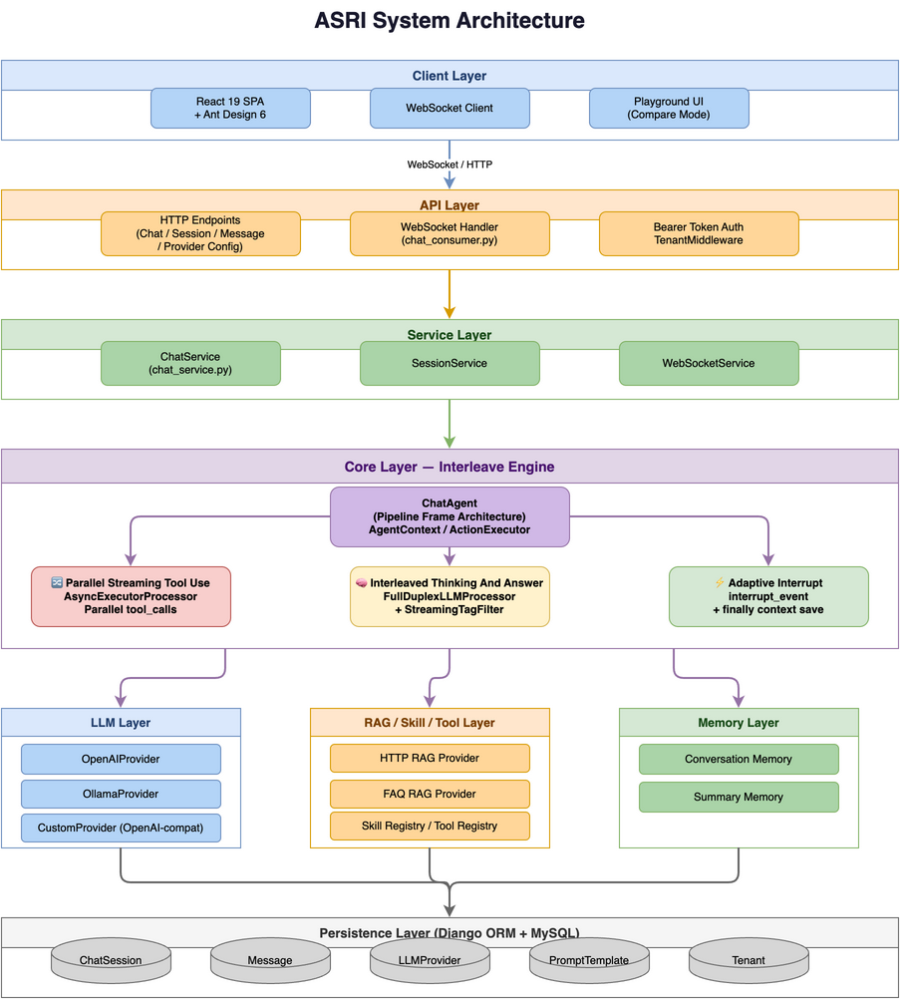

# ASRI - 智能对话机器人服务

[](LICENSE)
[](https://www.python.org/)
[](https://www.djangoproject.com/)
[](https://react.dev/)

🇬🇧 [English Version](README.md)

## 项目简介

传统 LLM Agent 面临三大痛点：**延迟累积**（工具串行执行）、**推理不可见**（用户要等到最终答案才能看到中间过程）、**难以中途干预**（没有干净的打断机制）。

ASRI 是一个基于 Django 4.1 的智能对话机器人服务，在系统层彻底解决以上三大问题。内置独特的 **Interleave Engine**，支持三项突破性能力：边想边答、一心多用、随机应变——均基于统一的 Pipeline Agent（LLM 原生 function_calling 驱动）实现。

## 核心特性

### 三大核心能力

- **🧠 边想边答（流式工具调用）** — 大模型流式输出过程中，一旦出现完整的 `<tool_call>`，立即并行触发工具执行，无需等待 LLM 完成整个输出。思考与工具执行在同一流中交叠，将首个 Token 延迟从秒级压缩到毫秒级。

- **🔀 一心多用（并发工具）** — LLM 在单次回复中规划出多个工具调用，`AsyncExecutorProcessor` 并行执行全部工具，不存在串行瓶颈。

- **⚡ 随机应变（自适应中断）** — Agent loop 每轮循环后动态决定下一步行动；用户可随时打断，Agent 自动判断是合并回答还是逐一处理，上下文无缝衔接。

### 其他特性

- **数据库驱动 Prompt**：所有系统提示词按租户从数据库加载，无需改代码即可配置
- **多 LLM 支持**：OpenAI API、Ollama、任意 OpenAI-compatible 端点，更多模型支持敬请期待
- **WebSocket 流式**：支持 WebSocket 和 SSE Token 级实时流式输出
- **RAG 集成**：HTTP RAG 和 FAQ RAG 两种模式
- **多租户隔离**：Bearer Token 认证，完整的租户级配置/技能/数据隔离
- **会话管理**：完整的 Session 和 Message 管理，支持一问多答/多问一答
- **可扩展架构**：通过 Provider/Registry 模式自定义 Skill、Tool、Prompt
- **数据库支持**：SQLite（默认，零配置）或 MySQL（生产）
- **Docker 支持**：一键部署，Docker Compose 开箱即用

## 系统架构



> 源文件：[`docs/architecture.drawio`](docs/architecture.drawio) — 可用 [draw.io](https://app.diagrams.net/) 打开编辑。

## ARC 模型 — 敬请期待

[ARC（Advantage Regularization Conditioning）](https://yuque.antfin.com/tongyongqi.yq/envrsy/zq8hgaem6dpblg2g) 是一种面向开放式交互场景的强化学习算法。它解决了多策略 RL 中的**奖励不公**问题——当 Agent 需要学习何时静默思考、何时对外回答、何时调用工具时，全局优势比较会不公平地惩罚较短策略。

ARC 让模型公平地掌握所有这些策略。结合 INTER3 通道分离架构，实现了**更高准确率与更低延迟**的双重提升：

### 基准测试结果（Qwen3-8B）

| 方法 | Tau2 Bench（航空） | Tau2 Bench（零售） | Tau2 Bench（电信） | TTFT |
|------|-------------------:|-------------------:|-------------------:|-----:|
| Qwen3-8B No-Think | 14.61 | 36.55 | 32.75 | 0.05s |
| Qwen3-8B Think | 29.75 | 38.71 | 23.46 | 4.91s |
| SFT | 38.58 | — | — | 0.61s |
| SFT + GRPO | 33.35 | — | — | 0.71s |
| **SFT + (GRPO + ARC)** | **40.95** | **45.61** | **21.05** | **1.27s** |

> **核心发现**：ARC 在 Tau2 Bench 上相比 Think 基线提升 +9.60（31.35 → 40.95），同时 TTFT 降低 **74%**（4.91s → 1.27s）。延迟与质量的权衡被重新定义。

> ⚠️ ARC 模型尚未包含在本次开源中，敬请期待！

## 技术栈

| 层级 | 技术 |
|------|------|
| 后端 | Django 4.1, Python 3.10+, Daphne (ASGI) |
| 前端 | React 19, TypeScript 5.9, Ant Design 6, Vite 8 |
| 状态管理 | Zustand, TanStack Query |
| 数据库 | SQLite（默认，零配置）、MySQL（生产） |
| 缓存 | Redis (生产), InMemory (开发) |
| WebSocket | Channels 4.0+, Daphne |

## 快速开始

### 环境要求

- Python 3.10+
- Node.js 18+

### 30 秒快速安装

```bash
git clone https://github.com/your-org/asri.git
cd asri
./setup.sh       # 一键安装：venv + pip + npm + build + migrate + seed
./start.sh       # 启动服务
```

访问 http://127.0.0.1:8000/ 即可开始聊天。

### 手动安装

参考 [安装指南](docs/INSTALL_cn.md) 获取分步安装、Docker 部署和生产环境配置。

## API 概览

### 聊天接口

| 方法 | 路径 | 说明 |
|------|------|------|
| POST | `/chatbot/api/chat/` | 非流式对话（支持 `stream=true` SSE 流式） |
| WebSocket | `/ws/chat/{session_id}/` | WebSocket 流式对话（Bearer Token 认证） |
| POST | `/chatbot/api/chat/batch/` | 多问一答 |

### 会话管理

| 方法 | 路径 | 说明 |
|------|------|------|
| GET | `/chatbot/api/sessions/` | 会话列表 |
| POST | `/chatbot/api/sessions/` | 创建会话 |
| GET | `/chatbot/api/sessions/{id}/` | 会话详情 |
| PUT | `/chatbot/api/sessions/{id}/` | 更新会话 |
| DELETE | `/chatbot/api/sessions/{id}/` | 删除会话 |
| GET | `/chatbot/api/sessions/{id}/messages/` | 历史消息 |

### Provider 管理

| 方法 | 路径 | 说明 |
|------|------|------|
| GET/POST | `/chatbot/api/llm-providers/` | LLM Provider 配置 |
| GET/POST | `/chatbot/api/rag-providers/` | RAG Provider 配置 |
| GET/POST | `/chatbot/api/tools/` | Tool 管理 |
| GET/POST | `/chatbot/api/skills/` | Skill 管理 |

## LLM Provider 配置

LLM Provider 通过 Admin 页面配置（http://127.0.0.1:8000/admin/）。
在 **Models** 部分添加 OpenAI、Ollama 或自定义 LLM Provider。
系统不通过环境变量加载 LLM 配置。

## 文档导航

| 文档 | 说明 |
|------|------|
| [安装指南](docs/INSTALL_cn.md) | 详细的安装说明 |
| [架构文档](docs/ARCHITECTURE_cn.md) | 系统架构概览 |
| [贡献指南](CONTRIBUTING_cn.md) | 如何参与项目贡献 |
| [聊天 API](docs/chat-api.md) | 聊天 API 文档（HTTP/WebSocket/SSE） |
| [Agent 系统](docs/agent-guide.md) | ReAct/Pipeline Agent 详解 |
| [LLM/RAG 指南](docs/llm-rag-guide.md) | LLM 和 RAG 集成 |
| [Skill 指南](docs/skill-guide.md) | Skill 系统文档 |
| [Tool 指南](docs/tool-guide.md) | Tool 系统文档 |
| [扩展指南](docs/extension-guide.md) | 添加新的 Provider/Tool/Skill |

## 测试

```bash
# 运行所有测试
cd backend
pytest apps/tests/ -v

# 运行特定测试
pytest apps/tests/test_agent.py -v

# 运行前端 E2E 测试
cd frontend
npm run test:e2e
```

## 项目结构

```
asri/
├── backend/                 # Django 后端
│   ├── apps/                # 应用模块
│   │   ├── agent/           # Agent 实现
│   │   ├── api/             # HTTP & WebSocket API
│   │   ├── integrations/    # Provider 抽象层
│   │   ├── services/        # 业务逻辑层
│   │   └── tenant/          # 多租户支持
│   ├── manage.py            # Django 管理脚本
│   └── requirements.txt     # Python 依赖
├── frontend/                # React 前端
│   ├── src/                 # 源代码
│   ├── package.json         # NPM 依赖
│   └── vite.config.ts       # Vite 配置
├── config/                  # Django 项目配置
├── docs/                    # 技术文档
├── Dockerfile               # Docker 镜像
├── docker-compose.yml       # Docker Compose
├── setup.sh                 # 一键安装脚本
└── start.sh                 # 启动脚本
```

## 参与贡献

我们欢迎任何形式的贡献！请阅读 [贡献指南](CONTRIBUTING_cn.md) 了解行为准则和提交流程。

## 安全

如果您发现安全漏洞，请参阅 [安全政策](SECURITY_cn.md) 了解负责任的披露流程。

## 许可证

本项目采用 Apache License 2.0 开源许可证 - 详见 [LICENSE](LICENSE) 文件。
